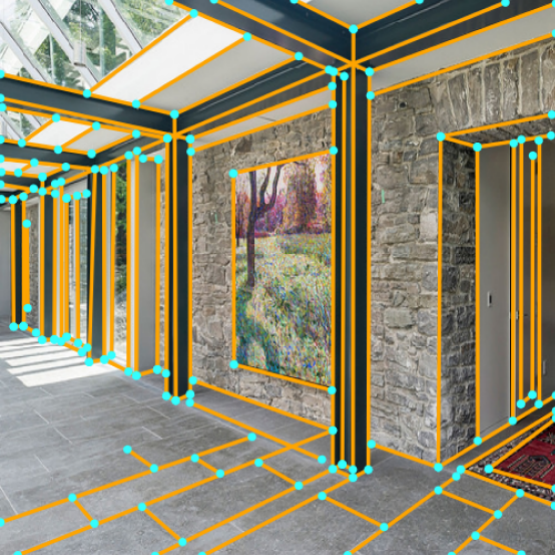
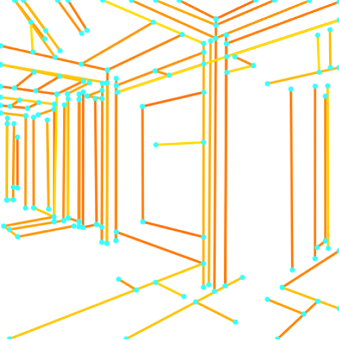
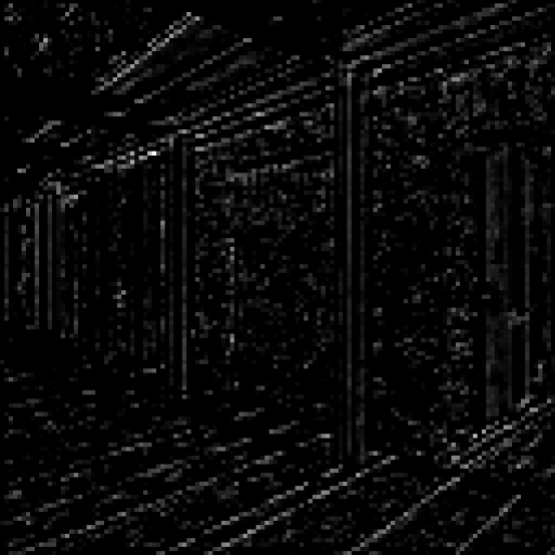
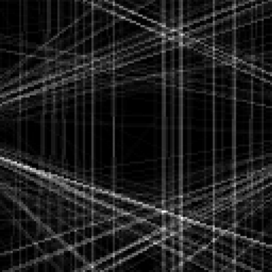
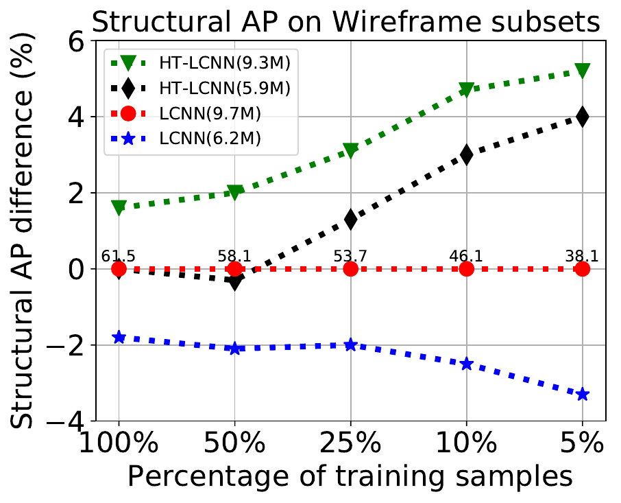
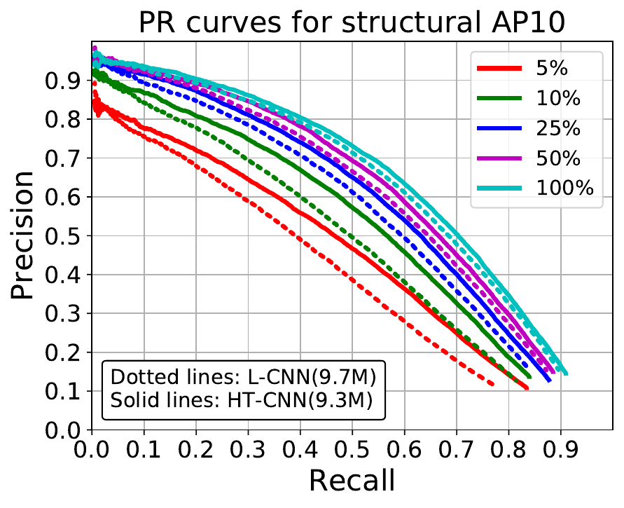
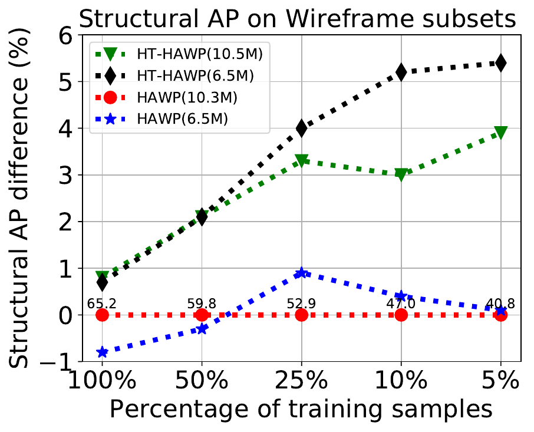
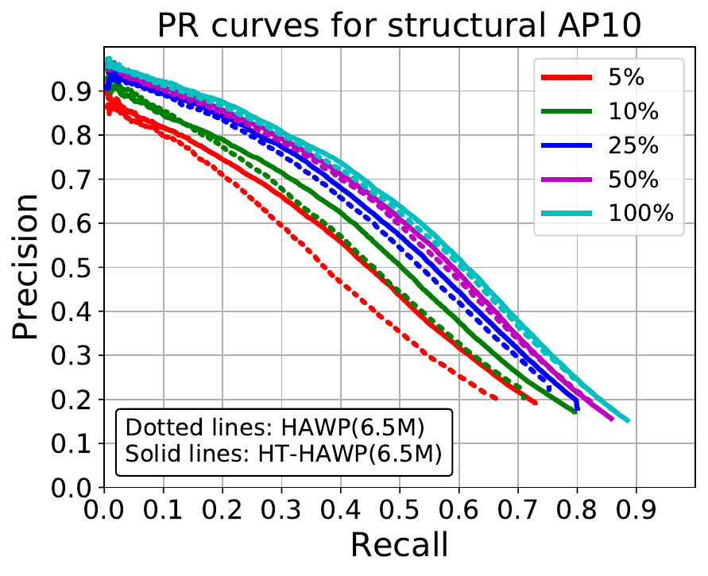

# Deep-Hough-Transform-Line-Priors 

Official implementation: [Deep-Hough-Transform-Line-Priors](https://arxiv.org/abs/2007.09493) (ECCV 2020) 

[Yancong Lin](https://yanconglin.github.io/), and [Silvia Laura Pintea](https://silvialaurapintea.github.io/), and [Jan C. van Gemert](http://jvgemert.github.io/)

Vision Lab, Delft University of Technology, the Netherlands

## Introduction

Classical work on line segment detection is knowledge-based; it uses carefully designed geometric priors using either image gradients, pixel groupings, or Hough transform variants. Instead, current deep learning methods do away with all prior knowledge and replace priors by training deep networks on large manually annotated datasets. Here, we reduce the dependency on labeled data by building on the classic knowledge-based priors while using deep networks to learn features. We add line priors through a trainable Hough transform block into a deep network. Hough transform provides the prior knowledge about global line parameterizations, while the convolutional layers can learn the local gradient-like line features. On the Wireframe and York Urban datasets we show that adding prior knowledge improves data efficiency as line priors no longer need to be learned from data.

## Main Features: added Hough line priors

           
  
 From left to right:  Ground Truth, Predictions, Input features with noise, and HT-IHT features. 
 
 The added line priors are able to localize line cadidates from the noisy input.
 
## Main Contribution: the HT-IHT Module
  
 
 An overview of the proposed HT-IHT module.
 
 
 ## Main Result: imptroved data and parameter efficiency
      
  
      


## Code Structure

Our implementation is largely based on [LCNN](https://github.com/zhou13/lcnn).  (Thanks Yichao Zhou for such a nice implementation!)

We made minor changes to fit our HT-IHT module. If you are only interested in the HT-IHT module, please check ["HT.py"](https://github.com/yanconglin/Deep-Hough-Transform-Line-Priors/blob/master/ht-lcnn/lcnn/models/HT.py).

Below is a quick overview of the function of each file.

```bash
########################### Data ###########################
figs/
data/                           # default folder for placing the data
    wireframe/                  # folder for ShanghaiTech dataset (Huang et al.)
logs/                           # default folder for storing the output during training
########################### Code ###########################
config/                         # neural network hyper-parameters and configurations
    wireframe.yaml              # default parameter for ShanghaiTech dataset
dataset/                        # all scripts related to data generation
    wireframe.py                # script for pre-processing the ShanghaiTech dataset to npz
misc/                           # misc scripts that are not important
    draw-wireframe.py           # script for generating figure grids
    plot-sAP.py                 # script for plotting sAP10 for all algorithms
lcnn/                           # lcnn module so you can "import lcnn" in other scripts
    models/                     # neural network structure
        hourglass_pose.py       # backbone network (stacked hourglass)
        hourglass_ht.py         # backbone network (HT-IHT)
        HT.py                   # the HT-IHT Module
        line_vectorizer.py      # sampler and line verification network
        multitask_learner.py    # network for multi-task learning
    datasets.py                 # reading the training data
    metrics.py                  # functions for evaluation metrics
    trainer.py                  # trainer
    config.py                   # global variables for configuration
    utils.py                    # misc functions
demo.py                         # script for detecting wireframes for an image
eval-sAP.py                     # script for sAP evaluation
eval-mAPJ.py                    # script for mAPJ evaluation
train.py                        # script for training the neural network
process.py                      # script for processing a dataset from a checkpoint
```

## Remarks on the Hough Transform
The HT-IHT module in this repo runs both on CPUs and GPUs, but consumes more memory (depends on the image size). 

Update 1: I have released a CUDA implementation of both HT and IHT modules in my recent work on vanishing point detection. Please check [ Deep vanishing point detection:  Geometric priors make dataset variations vanish](https://github.com/yanconglin/VanishingPoint_HoughTransform_GaussianSphere) for details. 

There is also another CUDA implementation for Hough Transform. Check [Deep Hough Transform for Semantic Line Detection](https://github.com/Hanqer/deep-hough-transform) for details.

If you would like to understand the intuition behind the initialization, check this excellent dissertation (Chapter 2) <br/> "Magnusson, M.: Linogram and Other Direct Fourier Methods for Tomographic Reconstruction. Linköping University (1993)".

Update 2: There is also an work on using HT/IHT modules for traffic lane detection. Please check [  Semi-Supervised Lane Detection with Deep Hough Transform ](https://github.com/yanconglin/Semi-Supervised-Lane-Detection-with-Deep-Hough-Transform) for details. 

## Reproducing Results

### Installation

For easy reproducibility, you are suggested to install [miniconda](https://docs.conda.io/en/latest/miniconda.html) (or [anaconda](https://www.anaconda.com/distribution/) if you prefer) before following executing the following commands. 

```bash
conda create -y -n lcnn
source activate lcnn
conda install -y pytorch cudatoolkit=10.1 -c pytorch
conda install -y tensorboardx -c conda-forge
conda install -y pyyaml docopt matplotlib scikit-image opencv
```

### Pre-trained Models

You can download our reference pre-trained models (on the official training set of the Wireframe dataset) from [SURFdrive](https://surfdrive.surf.nl/files/index.php/s/hpi721UAIr43avr). Use `demo.py`, `process.py`, and
`eval-*.py` to evaluate the pre-trained models.

### Detect Wireframes for Your Own Images
To test on your own images, you need download the pre-trained models and execute

```Bash
python ./demo.py -d 0 config/wireframe.yaml <path-to-pretrained-pth> <path-to-image>
```
Here, `-d 0` is specifying the GPU ID used for evaluation, and you can specify `-d ""` to force CPU inference.

### Processing the Dataset

Download and unzip the dataset into the folder "ht-lcnn/data", from [Learning to Parse Wireframes in Images of Man-Made Environments](https://github.com/huangkuns/wireframe)

```bash
wireframe.py data/wireframe_raw data/wireframe
```

** Recommend** You can also download the pre-processed dataset directly from [LCNN](https://github.com/zhou13/lcnn#downloading-the-processed-dataset). Details are as follows:

Make sure `curl` is installed on your system and execute
```bash
cd data
../misc/gdrive-download.sh 1T4_6Nb5r4yAXre3lf-zpmp3RbmyP1t9q wireframe.tar.xz
tar xf wireframe.tar.xz
rm wireframe.tar.xz
cd ..
```

### Training
The default batch size assumes your have a GTX 1080Ti or RTX 2080Ti.

To train the neural network on GPU 0 (specified by `-d 0`) with the default parameters, execute
```bash
python ./train.py -d 0 --identifier baseline config/wireframe.yaml
```

### Testing Pretrained Models
To generate wireframes on the validation dataset with the pretrained model, execute

```bash
./process.py config/wireframe.yaml <path-to-checkpoint.pth>
```

### Evaluation

To evaluate the sAP of all your checkpoints under `logs/`, execute
```bash
python eval-sAP.py logs/*/npz/*
```

To evaluate the mAP<sup>J</sup>, execute
```bash
python eval-mAPJ.py logs/*/npz/*
```

To evaluate Precision-Recall, please check [MCMLSD: A Dynamic Programming Approach to Line Segment Detection](https://www.elderlab.yorku.ca/mcmlsd/) for details. This metric enforces 1:1 correspondence either at pixel or segment level, and penalizes both over- and under-segmentation. Therefore, we chose this one for pixel-level evaluation. In contrast, the evaluation in [Learning to Parse Wireframes in Images of Man-Made Environments](https://github.com/huangkuns/wireframe) is deeply flawed, as it does not penalize over-/under-segmentation.

If you have trouble reproducing some results, [this discussion](https://github.com/zhou13/lcnn/issues/24) may help.


### Cite Deep Hough-Transform Line Priors

If you find Deep Hough-Transform Line Priors useful in your research, please consider citing:
```bash
@article{lin2020ht,
  title={Deep Hough-Transform Line Priors},
  author={Lin, Yancong and Pintea, Silvia L and van Gemert, Jan C},
  booktitle={European Conference on Computer Vision},
  year={2020}
}
```
